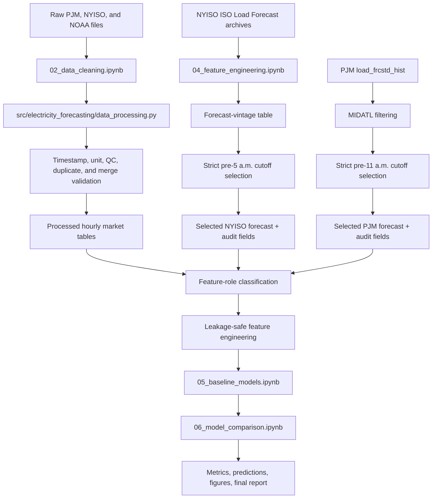
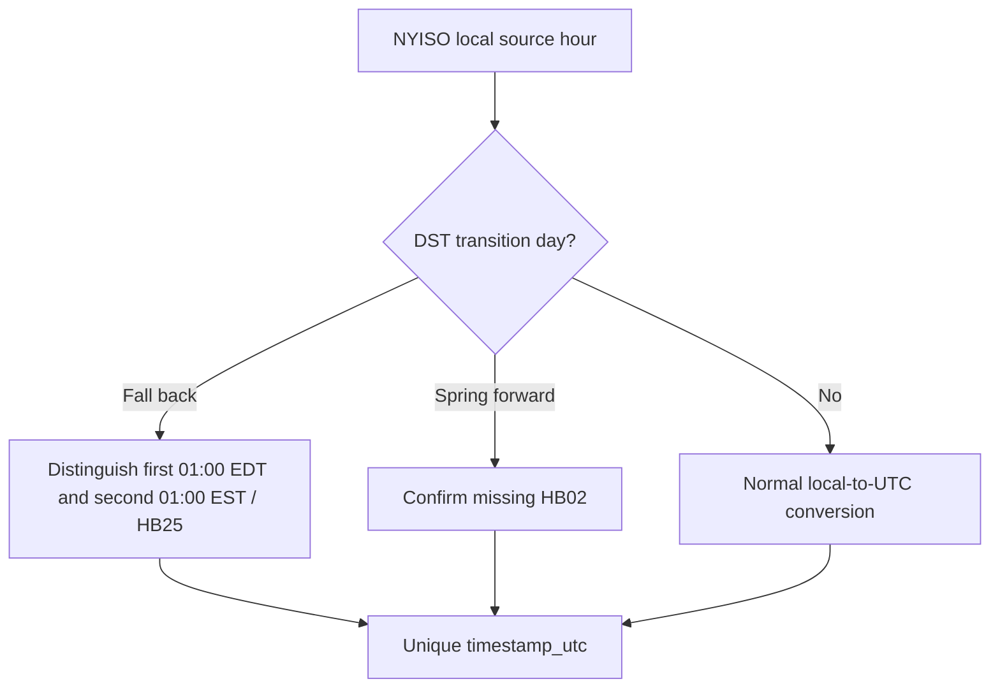

# Notebook and Code Pipeline Map

**Last updated:** September 1, 2026

This map documents the feasibility pipeline and the planned extension to the 2020–2024 study.

## Current pipeline

## Predictor and audit flow

| Input | Operational-model role | Handling |
|---|---|---|
| Day-ahead price | Target and source of safe historical lags | Never expose same target/future values to predictor matrix |
| Calendar fields | Approved predictors | Derive from target delivery hour |
| NYISO selected load forecast | Conditional predictor | Latest eligible vintage strictly before 5:00 a.m.; current availability is proxy-based |
| PJM MIDATL historical load forecast | Approved candidate | Latest eligible `load_frcstd_hist` snapshot strictly before 11:00 a.m. |
| Forecast timing/provenance | Audit only | Preserve, exclude from default predictor matrix |
| Same-hour actual load | Excluded operationally | EDA or safe lag only |
| Same-hour observed NOAA weather | Excluded operationally | EDA/upper-bound or safe lag only |
| Archived weather forecast | Under investigation | Include only with reproducible issue time, valid time, and vintage |

## NYISO DST branch

NYISO DST handling is now documented by TB-064 and TB-088.

The remaining DST task is to verify actual 2020–2024 source files conform to the documented conventions.

## Full-period extension

Before final 2020–2024 modeling:

1. validate PSEG pnode `51301`, `PS`, MIDATL, `HUD VL`, and PTID `61758` across every study year;
2. determine whether NYISO preserves an authoritative historical load-forecast publication/availability timestamp;
3. if NYISO availability cannot be authoritatively established, exclude `load_forecast_mw` from the strict operational feature set;
4. acquire and implement the PJM MIDATL `load_frcstd_hist` workflow using the strict pre-11:00 a.m. rule;
5. implement NYISO TB-064/TB-088 DST handling and validate actual spring/fall transition dates;
6. test PJM DST behavior in Data Miner timestamp fields;
7. audit NOAA station histories and raw fixed-standard-time conversion;
8. decide the final PJM historical price feed;
9. audit annual schema, units, missingness, and revision behavior;
10. test the September 1, 2021 PJM fast-start-pricing change as a possible structural break; and
11. rerun cleaning, feature engineering, and automated leakage checks before final model training.

## Reverse-engineering workflow

1. Use the notebook outline to find the relevant Markdown heading or code cell.
2. Read the corresponding function in `src/electricity_forecasting/`.
3. Identify input, output, validation, and destination dataset.
4. Check `data_dictionary.md` for field roles and `methodology_decisions.md` for availability rules.
5. Update this map only when a new source, intermediate dataset, cutoff, major transformation, or model stage changes the high-level flow.
