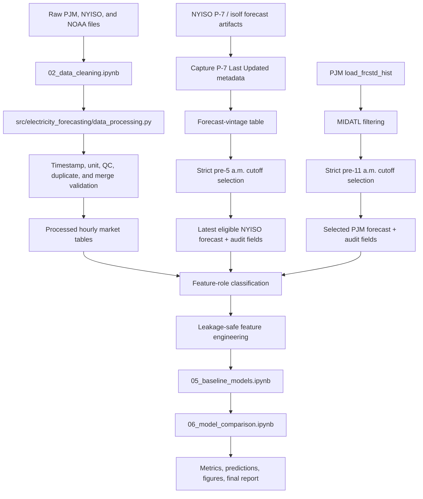
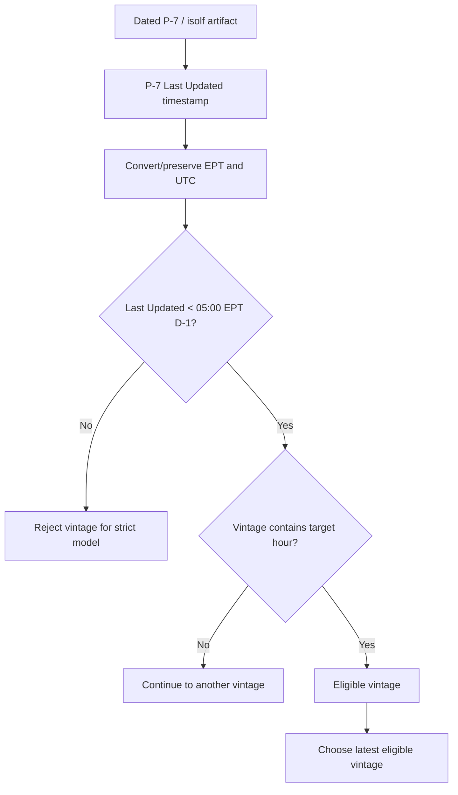
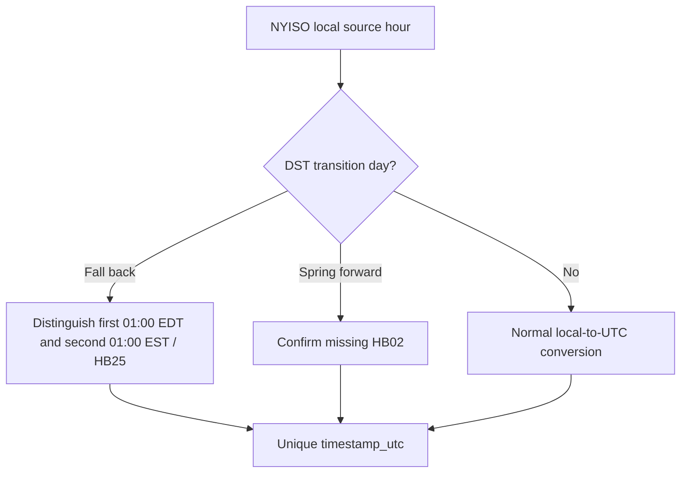

# Notebook and Code Pipeline Map

**Last updated:** September 1, 2026

This map documents the feasibility pipeline and the planned extension to the 2020–2024 study.

## Current pipeline

## Predictor and audit flow

| Input | Operational-model role | Handling |
|---|---|---|
| Day-ahead price | Target and source of safe historical lags | Never expose same target/future values to predictor matrix |
| Calendar fields | Approved predictors | Derive from target delivery hour |
| NYISO selected P-7 load forecast | Approved candidate with evidence caveat | Use latest P-7 vintage whose `Last Updated` is strictly before 5:00 a.m. and whose multi-day horizon contains the target hour |
| PJM MIDATL historical load forecast | Approved candidate | Latest eligible `load_frcstd_hist` snapshot strictly before 11:00 a.m. |
| Forecast timing/provenance | Audit only | Preserve P-7 `Last Updated`, ZIP-entry timestamp, PJM `evaluated_at`, source file, cutoff, and horizon; exclude from default predictor matrix |
| Same-hour actual load | Excluded operationally | EDA or safe lag only |
| Same-hour observed NOAA weather | Excluded operationally | EDA/upper-bound or safe lag only |
| Archived weather forecast | Under investigation | Include only with reproducible issue time, valid time, and vintage |

## NYISO P-7 availability branch

The P-7 `Last Updated` timestamp is treated as public-source inferred availability evidence. `availability_is_proxy=True` remains until NYISO explicitly confirms that the field is formally the public posting/availability time. ZIP-entry timestamps remain secondary provenance when available.

Because current P-7 examples update around 7–8 a.m. on D−1, the P-7 artifact whose first forecast day is the target day will often fail the strict 5:00 a.m. cutoff. The selector must therefore search older P-7 vintages whose multi-day forecast horizon still includes the target hour.

## NYISO DST branch

NYISO DST handling is documented by TB-064 and TB-088.

The remaining DST task is to verify actual 2020–2024 source files conform to the documented conventions.

## Full-period extension

Before final 2020–2024 modeling:

1. validate PSEG pnode `51301`, `PS`, MIDATL, `HUD VL`, and PTID `61758` across every study year;
2. capture P-7 `Last Updated` metadata across the full NYISO study period;
3. update and regression-test NYISO forecast-vintage selection using `p7_last_updated` and the strict pre-5:00 a.m. rule;
4. retain ZIP-entry timestamps as secondary provenance rather than the primary availability source;
5. acquire and implement the PJM MIDATL `load_frcstd_hist` workflow using the strict pre-11:00 a.m. rule;
6. implement NYISO TB-064/TB-088 DST handling and validate actual spring/fall transition dates;
7. test PJM DST behavior in Data Miner timestamp fields;
8. audit NOAA station histories and raw fixed-standard-time conversion;
9. decide the final PJM historical price feed;
10. audit annual schema, units, missingness, and revision behavior;
11. test the September 1, 2021 PJM fast-start-pricing change as a possible structural break; and
12. rerun cleaning, feature engineering, and automated leakage checks before final model training.

## Required NYISO code changes

The existing January implementation must be revised before it becomes the full-period production path:

- ingest/store `p7_last_updated` for each daily P-7 forecast artifact;
- preserve `zip_entry_last_modified` separately for audit;
- set `forecast_available_at` from `p7_last_updated` when present;
- set `availability_basis = "p7_last_updated"`;
- keep `availability_is_proxy = True` until NYISO confirms the field's formal availability semantics;
- test that a P-7 update at or after 5:00 a.m. D−1 is rejected;
- test that an older P-7 vintage is selected when it remains within the multi-day horizon;
- require exactly one latest eligible vintage per target hour where coverage exists; and
- regenerate the January forecast-vintage and modeling-ready outputs before treating them as the current checkpoint.

## Reverse-engineering workflow

1. Use the notebook outline to find the relevant Markdown heading or code cell.
2. Read the corresponding function in `src/electricity_forecasting/`.
3. Identify input, output, validation, and destination dataset.
4. Check `data_dictionary.md` for field roles and `methodology_decisions.md` for availability rules.
5. Update this map only when a new source, intermediate dataset, cutoff, major transformation, or model stage changes the high-level flow.
